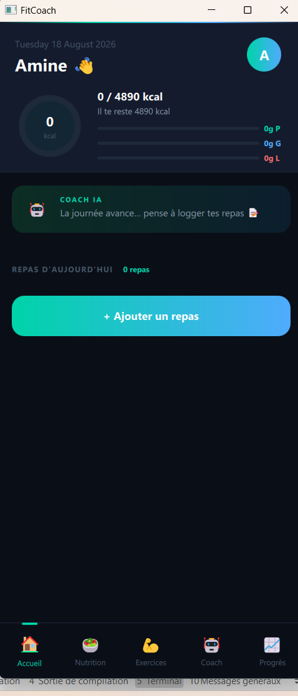
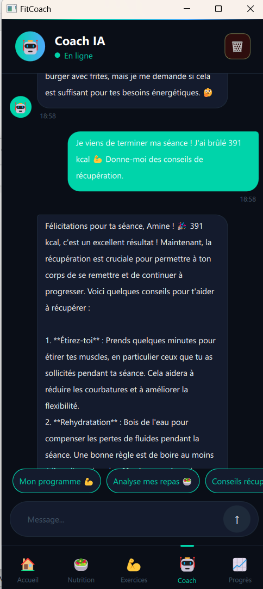
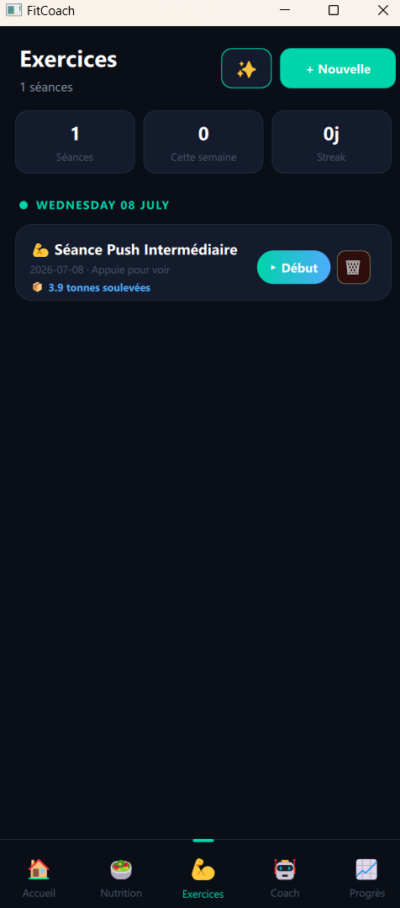

# FitCoach 🏋️‍♂️

Application desktop fitness & nutrition avec coach IA intégré, développée en **Qt 6 / QML / C++20**.


## 📋 Description

FitCoach est une application de suivi fitness et nutrition qui combine :

- un **coach IA conversationnel** (via l'API Groq) capable d'analyser les repas en photo,
- un **générateur de programme d'entraînement** personnalisé selon le profil et l'historique de l'utilisateur,
- un **mode séance active** avec minuteur de repos, suivi des séries et calcul des calories brûlées,
- un **suivi de progression** (poids, calories, statistiques) avec graphiques animés.

Ce projet a été développé comme projet personnel pour explorer l'architecture **MVVM** avec Qt/QML et l'intégration d'API IA dans une application native. Le choix de **QML plutôt que Qt Widgets** est délibéré : QML permet de partager l'essentiel de l'interface entre desktop et mobile (Android/iOS) via les mêmes modules Qt, ce qui rend un futur portage mobile réaliste sans réécrire la couche UI — voir [Roadmap](#-roadmap).

## ✨ Fonctionnalités

- **Onboarding** en 6 étapes pour configurer le profil utilisateur
- **Suivi nutritionnel** : ajout de repas, analyse photo par IA (vision), calcul macros
- **Suivi d'entraînement** : CRUD séances/exercices, bibliothèque de ~75 exercices
- **Mode séance active** : minuteur de repos configurable, séries cochables, calcul calories brûlées
- **Programme IA** : génération de séances personnalisées (rotation Push/Pull/Legs/Core) selon profil et historique
- **Coach IA** : chat contextuel avec historique persistant, messages automatiques post-séance
- **Suivi de progression** : records personnels (PR), volume soulevé, répartition musculaire, graphiques animés (calories hebdo, courbe de poids)

## 🛠️ Stack technique

| Composant | Technologie |
|---|---|
| Framework UI | Qt 6.11 (QML + Widgets) |
| Langage | C++20 |
| Architecture | MVVM |
| Base de données | SQLite |
| Build system | CMake |
| CI/CD | GitHub Actions (build + tests automatisés) |
| API IA | Groq (chat + vision) — `llama-3.3-70b-versatile`, `llama-4-scout` |

## 🏗️ Architecture

```
FitCoach/
├── main.cpp
├── CMakeLists.txt
├── Main.qml
├── ui/
│   ├── theme/          # Thème visuel centralisé
│   └── pages/           # Écrans de l'application
├── database/
│   └── DatabaseManager  # Couche d'accès SQLite
├── services/
│   ├── NutritionService
│   ├── ExerciseService
│   └── AICoachService    # Intégration API Groq
├── viewmodels/           # Logique métier (pattern MVVM)
├── tests/                # Tests unitaires Qt Test
└── docs/
    └── ARCHITECTURE.md   # Documentation détaillée de l'architecture
```

Voir [`docs/ARCHITECTURE.md`](docs/ARCHITECTURE.md) pour le détail des choix d'architecture.

## 🚀 Installation

### Prérequis

- Qt 6.11 ou supérieur
- CMake 3.16+
- Compilateur compatible C++20 (MinGW 64-bit recommandé sous Windows)
- Une clé API [Groq](https://console.groq.com/keys) (gratuite)

### Étapes

```bash
git clone https://github.com/amineelghobni/FitCoach.git
cd FitCoach
```

Configure ta clé API :

```bash
cp config.local.h.example config.local.h
# Édite config.local.h et renseigne ta clé Groq
```

Compile avec Qt Creator (ouvre `CMakeLists.txt`) ou en ligne de commande :

```bash
cmake -S . -B build
cmake --build build
```

## 🧪 Tests & CI

Les tests unitaires (Qt Test) et le build sont exécutés automatiquement à chaque push et pull request via GitHub Actions.

```bash
cmake --build build --target tst_exerciseviewmodel
ctest --test-dir build --output-on-failure
```

## 📸 Aperçu

<table>
  <tr>
    <td width="33%"></td>
    <td width="33%"></td>
    <td width="33%"></td>
  </tr>
</table>

## 📝 Roadmap

### Fonctionnalités
- [ ] Badges de progression (🥇 première séance, 🔥 streak, 💪 volume total)
- [ ] Plan nutritionnel hebdomadaire généré par IA
- [ ] Export PDF/CSV des rapports mensuels
- [ ] Intégrations Garmin / Apple Watch

### Portage mobile
- [ ] Adaptation des layouts QML pour petits écrans (Android/iOS)
- [ ] Build Android via Qt for Android
- [ ] Gestion des permissions mobiles (caméra pour l'analyse photo, notifications)
- [ ] Synchronisation des données entre desktop et mobile

### Qualité & industrialisation
- [ ] Couverture de tests étendue (ViewModels métier : volume, PR, calories)
- [ ] Base de données de test isolée (SQLite en mémoire), découplée de la base de développement
- [ ] Analyse statique du code (SonarQube ou équivalent open-source)
- [ ] Pipeline CI multi-plateforme (Linux/Windows/macOS)

## 👤 Auteur

**Amine El Ghobni**
Ingénieur logiciel C++ — [LinkedIn](https://www.linkedin.com/in/amine-el-ghobni-61a2021b6/)

## 📄 Licence

Ce projet est sous licence MIT — voir le fichier [LICENSE](LICENSE) pour plus de détails.
